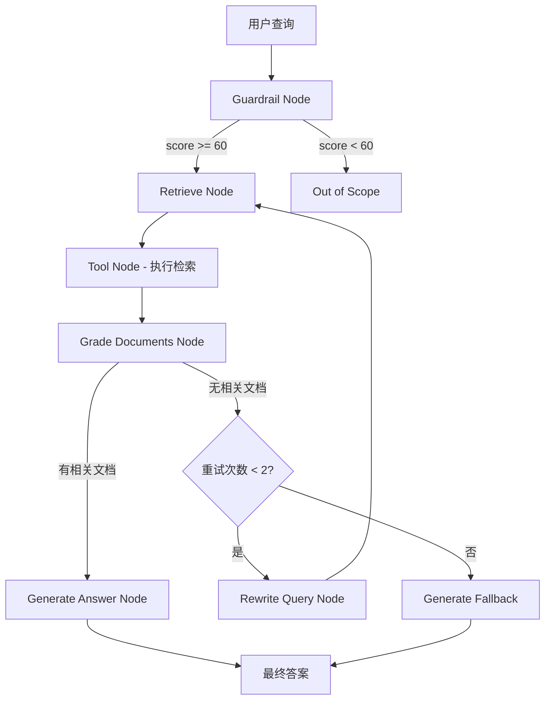

# arXiv Paper Curator - 完整 API 文档

## 📋 API 概览

该 RAG 系统提供 **6 个核心 API 端点**，分为 4 个功能模块：

| 模块 | 端点数量 | 用途 |
|------|---------|------|
| **Health Check** | 1 | 系统健康监控 |
| **Search** | 1 | 文档混合搜索 |
| **Basic RAG** | 2 | 基础问答（同步/流式） |
| **Agentic RAG** | 2 | 智能问答 + 反馈 |

---

## 🏗️ API 架构关系图

```
┌─────────────────────────────────────────────────────────────┐
│                     FastAPI Application                      │
│                  (http://localhost:8000)                     │
└─────────────────────────────────────────────────────────────┘
                            │
        ┌───────────────────┼───────────────────┐
        │                   │                   │
        ▼                   ▼                   ▼
┌──────────────┐   ┌──────────────┐   ┌──────────────┐
│ Health Check │   │    Search    │   │     RAG      │
│   Module     │   │   Module     │   │   Modules    │
└──────────────┘   └──────────────┘   └──────────────┘
        │                   │                   │
        │                   │          ┌────────┴────────┐
        ▼                   ▼          ▼                 ▼
   /health          /hybrid-search   /ask          /ask-agentic
                                      /stream       /feedback
```

---

## 📍 完整 API 端点列表

### 1. Health Check Module

#### `GET /api/v1/health`

**功能**: 综合健康检查，用于监控和负载均衡探测

**响应示例**:
```json
{
  "status": "ok",
  "version": "0.1.0",
  "environment": "development",
  "service_name": "arxiv-paper-curator",
  "services": {
    "database": {
      "status": "healthy",
      "message": "Connected successfully"
    },
    "opensearch": {
      "status": "healthy",
      "message": "Index 'arxiv-papers-chunks' with 1523 documents"
    },
    "ollama": {
      "status": "healthy",
      "message": "Ollama running with 2 models loaded"
    }
  }
}
```

**检查的服务**:
- **PostgreSQL**: 执行 `SELECT 1` 验证连接
- **OpenSearch**: 检查集群健康 + 索引统计
- **Ollama**: 异步健康检查，验证 LLM 可用性

**返回状态码**:
- `200 OK`: 所有服务正常
- `200 OK` + `status: "degraded"`: 部分服务异常（仍可响应）

**使用场景**:
- Kubernetes liveness/readiness probes
- 负载均衡器健康检查
- 运维监控告警
- 开发调试验证

---

### 2. Search Module

#### `POST /api/v1/hybrid-search/`

**功能**: 混合搜索（BM25 + Vector），支持自动降级到 BM25

**请求体**:
```json
{
  "query": "transformer attention mechanism",
  "size": 10,
  "from": 0,
  "categories": ["cs.AI", "cs.LG"],
  "latest_papers": false,
  "use_hybrid": true,
  "min_score": 0.0
}
```

**参数说明**:
- `query` (必填): 搜索查询文本 (1-500 字符)
- `size`: 返回结果数量 (1-100, 默认 10)
- `from`: 分页偏移量 (默认 0)
- `categories`: arXiv 分类过滤，如 `["cs.AI", "cs.LG"]`
- `latest_papers`: 是否按发布日期排序（否则按相关性）
- `use_hybrid`: 启用混合搜索（BM25 + 向量）
- `min_score`: 最低分数阈值

**响应示例**:
```json
{
  "query": "transformer attention mechanism",
  "total": 45,
  "hits": [
    {
      "arxiv_id": "1706.03762",
      "title": "Attention is All You Need",
      "authors": "Ashish Vaswani, Noam Shazeer, ...",
      "abstract": "The dominant sequence transduction models...",
      "published_date": "2017-06-12",
      "pdf_url": "https://arxiv.org/pdf/1706.03762.pdf",
      "score": 15.234,
      "chunk_text": "The Transformer uses multi-head self-attention...",
      "chunk_id": "1706.03762_chunk_42",
      "section_name": "Model Architecture",
      "highlights": {
        "chunk_text": ["<em>Transformer</em> uses multi-head self-<em>attention</em>"]
      }
    }
  ],
  "size": 10,
  "from": 0,
  "search_mode": "hybrid"
}
```

**搜索模式自动选择**:
```python
# 决策逻辑
if use_hybrid and query_embedding_success:
    search_mode = "hybrid"  # BM25 + Vector (RRF 融合)
else:
    search_mode = "bm25"    # 降级到纯关键词搜索
```

**技术实现**:
- **BM25**: OpenSearch 全文搜索（`chunk_text` 字段）
- **Vector**: Jina Embeddings (1024维) + HNSW 索引
- **RRF 融合**: OpenSearch 原生 Reciprocal Rank Fusion pipeline
- **分页**: 使用 `from` + `size` 参数

**使用场景**:
- 研究论文查找
- 语义相似文档检索
- 文献综述准备
- Gradio 搜索界面后端

---

### 3. Basic RAG Module

#### `POST /api/v1/ask`

**功能**: 基础 RAG 问答（非流式），带缓存和追踪

**请求体**:
```json
{
  "query": "What are the advantages of transformers over RNNs?",
  "top_k": 3,
  "use_hybrid": true,
  "model": "llama3.2:1b",
  "categories": ["cs.AI"]
}
```

**参数说明**:
- `query` (必填): 用户问题 (1-1000 字符)
- `top_k`: 检索文档块数量 (1-10, 默认 3)
- `use_hybrid`: 使用混合搜索 (默认 true)
- `model`: Ollama 模型名称 (默认 "llama3.2:1b")
- `categories`: 限制搜索的 arXiv 分类

**响应示例**:
```json
{
  "query": "What are the advantages of transformers over RNNs?",
  "answer": "Based on the research papers, transformers have several key advantages over RNNs:\n\n1. **Parallelization**: Unlike RNNs which process sequences sequentially, transformers can process all tokens simultaneously through self-attention, enabling much faster training.\n\n2. **Long-range dependencies**: The attention mechanism allows direct connections between any two positions in the sequence, avoiding the vanishing gradient problem that affects RNNs.\n\n3. **Scalability**: Transformers scale better with model size and data, as demonstrated by GPT and BERT.\n\nSource: Attention is All You Need (Vaswani et al., 2017)",
  "sources": [
    "https://arxiv.org/pdf/1706.03762.pdf",
    "https://arxiv.org/pdf/1810.04805.pdf"
  ],
  "chunks_used": 3,
  "search_mode": "hybrid"
}
```

**工作流程**:
```
1. 检查 Redis 缓存 (exact match)
   ├─ 命中 → 直接返回缓存结果
   └─ 未命中 → 继续处理
2. 生成查询 Embedding (如果 use_hybrid=true)
3. OpenSearch 混合搜索 (top_k 文档)
4. 构建 RAG Prompt
   ├─ 使用 RAGPromptBuilder.create_structured_prompt()
   └─ 失败降级到 create_rag_prompt()
5. Ollama LLM 生成答案
6. 存储结果到 Redis 缓存
7. 返回响应
```

**Langfuse 追踪**:
- Trace 级别: 完整请求
- Span 层次:
  - `embedding`: 查询向量化
  - `search`: 文档检索
  - `prompt_construction`: Prompt 构建
  - `generation`: LLM 生成

**缓存策略**:
- **Key**: Hash of `(query, top_k, use_hybrid, model, categories)`
- **TTL**: 6 小时 (可配置 `REDIS__TTL_HOURS`)
- **存储**: Redis (exact match only)

**错误处理**:
- `500`: 搜索失败、LLM 错误、系统异常
- 无相关文档: 返回 "I couldn't find any relevant information..."

**使用场景**:
- Web 应用问答接口
- 批量查询处理
- API 集成（非实时对话）

---

#### `POST /api/v1/stream`

**功能**: 流式 RAG 问答（Server-Sent Events）

**请求体**: 与 `/ask` 相同

**响应格式** (SSE):
```
data: {"sources": ["https://arxiv.org/pdf/1706.03762.pdf"], "chunks_used": 3, "search_mode": "hybrid"}

data: {"chunk": "Based "}

data: {"chunk": "on "}

data: {"chunk": "the "}

data: {"chunk": "research "}

data: {"chunk": "papers, "}

...

data: {"answer": "Based on the research papers, transformers have...", "done": true}
```

**SSE 事件序列**:
1. **Metadata 事件** (首个): 包含 `sources`, `chunks_used`, `search_mode`
2. **Chunk 事件** (多个): 每次 LLM 生成的文本片段 `{"chunk": "..."}`
3. **Done 事件** (最后): 完整答案 + `done: true` 标志

**工作流程**:
```
1. 检查 Redis 缓存
   ├─ 命中 → 流式发送缓存内容（模拟流式）
   └─ 未命中 → 继续处理
2. 检索文档 (与 /ask 相同)
3. 发送 Metadata 事件
4. 构建 Prompt
5. Ollama 流式生成
   └─ 每个 token → 立即发送 chunk 事件
6. 发送 Done 事件（包含完整答案）
7. 存储到 Redis 缓存
```

**缓存流式播放**:
```python
# 缓存命中时，将完整答案拆分为单词流式发送
for chunk in cached_response.answer.split():
    yield f"data: {json.dumps({'chunk': chunk + ' '})}\n\n"
```

**Headers**:
```
Content-Type: text/plain
Cache-Control: no-cache
Connection: keep-alive
```

**错误处理**:
```
data: {"error": "Search service unavailable"}
```

**使用场景**:
- Gradio 聊天界面
- 实时对话体验
- WebSocket 不可用时的替代方案
- 前端打字机效果

**对比 /ask**:
| 特性 | /ask | /stream |
|------|------|---------|
| 响应类型 | JSON | Server-Sent Events |
| 首字节时间 | 完整生成后 | 立即开始 |
| 用户体验 | 等待完整答案 | 实时流式显示 |
| 缓存行为 | 直接返回 | 模拟流式播放 |
| 前端复杂度 | 低 | 中等（SSE 处理） |

---

### 4. Agentic RAG Module

#### `POST /api/v1/ask-agentic`

**功能**: 智能 RAG 系统（LangGraph），具备决策能力和自适应检索

**请求体**: 与 `/ask` 相同

**响应示例**:
```json
{
  "query": "What are the latest developments in quantum computing?",
  "answer": "Based on recent research papers in quantum computing, key developments include:\n\n1. Quantum Error Correction: Recent papers demonstrate improved error rates using surface codes...\n\n2. Quantum Algorithms: Novel algorithms for optimization problems showing quantum advantage...\n\n[Citations: Nature 2023, Science 2024]",
  "sources": [
    "https://arxiv.org/pdf/2301.12345.pdf",
    "https://arxiv.org/pdf/2302.67890.pdf"
  ],
  "chunks_used": 3,
  "search_mode": "hybrid",
  "reasoning_steps": [
    "✓ Query validation: Scope check passed (score: 85/100)",
    "✓ Document retrieval: Retrieved 3 candidate chunks",
    "✓ Relevance grading: 3/3 chunks marked as relevant",
    "✓ Answer generation: Generated response from relevant context"
  ],
  "retrieval_attempts": 1,
  "trace_id": "langfuse-trace-abc123-def456"
}
```

**关键增强**:
- `reasoning_steps`: 透明的决策过程
- `retrieval_attempts`: 自适应检索次数（1-2）
- `trace_id`: Langfuse 追踪 ID（用于反馈）

**LangGraph 工作流**:



**节点详细说明**:

1. **Guardrail Node** (查询验证)
   - **功能**: 检测查询是否属于学术研究范围
   - **LLM 调用**: 是
   - **输出**: `GuardrailScoring` (score: 0-100, reason: str)
   - **阈值**: 60 分（可配置 `guardrail_threshold`）
   - **示例判断**:
     - ✓ "What are transformers?" → 85 分
     - ✗ "What's the weather?" → 20 分

2. **Retrieve Node** (检索协调)
   - **功能**: 创建 LangChain Tool 调用请求
   - **LLM 调用**: 否（仅生成 tool call）
   - **输出**: Tool invocation message

3. **Tool Node** (实际检索)
   - **功能**: 执行 OpenSearch 混合搜索
   - **调用**: `retrieve_papers` LangChain Tool
   - **返回**: `List[Document]` (LangChain 格式)

4. **Grade Documents Node** (文档评分)
   - **功能**: LLM 评估每个文档的相关性
   - **LLM 调用**: 是
   - **输出**: `GradeDocuments` (binary_score: yes/no, relevant_count: int)
   - **逻辑**:
     ```python
     relevant_count = sum(1 for doc in docs if grading_llm.grade(doc) == "yes")
     if relevant_count > 0:
         proceed_to_generation()
     else:
         rewrite_query()
     ```

5. **Rewrite Query Node** (查询优化)
   - **功能**: LLM 重写查询以提高检索质量
   - **LLM 调用**: 是
   - **触发条件**: 无相关文档 + 重试次数 < 2
   - **示例**:
     - 原查询: "What is attention?"
     - 重写后: "What is the attention mechanism in transformer neural networks?"

6. **Generate Answer Node** (答案生成)
   - **功能**: 基于相关文档生成最终答案
   - **LLM 调用**: 是
   - **Prompt**: 包含检索到的文档上下文
   - **输出**: 最终答案字符串

**状态管理** (AgentState):
```python
{
    "messages": [HumanMessage, AIMessage, ...],  # 对话历史
    "guardrail_result": GuardrailScoring,        # 验证结果
    "relevant_sources": List[Document],          # 相关文档
    "retrieval_attempts": int,                   # 重试次数
    "reasoning_steps": List[str]                 # 推理过程
}
```

**配置参数** (GraphConfig):
- `max_retrieval_attempts`: 最大检索重试次数 (默认 2)
- `guardrail_threshold`: 查询验证阈值 (默认 60)
- `model`: LLM 模型 (默认 "llama3.2:1b")
- `temperature`: 生成温度 (默认 0.0)
- `top_k`: 检索文档数量 (默认 3)

**Langfuse 完整追踪**:
```
Trace: agentic_rag_request_abc123
├─ Span: guardrail_validation (score: 85)
├─ Span: document_retrieval (3 docs)
├─ Span: document_grading (3/3 relevant)
└─ Span: answer_generation (model: llama3.2:1b)
```

**错误处理**:
- `422 Unprocessable Entity`: 查询验证失败（scope 外）
- `500 Internal Server Error`: LLM 调用失败、工作流异常

**对比 /ask**:
| 特性 | /ask | /ask-agentic |
|------|------|--------------|
| 查询验证 | ✗ | ✓ Guardrail |
| 文档评分 | ✗ | ✓ LLM Grading |
| 查询重写 | ✗ | ✓ 自动优化 |
| 推理透明度 | ✗ | ✓ reasoning_steps |
| LLM 调用次数 | 1 | 3-5 次 |
| 响应时间 | ~2-3s | ~5-8s |
| 准确性 | 中等 | 高 |
| 成本 | 低 | 中等 |

**使用场景**:
- 需要高准确性的研究查询
- 复杂/模糊问题的智能处理
- 需要审计追踪的企业应用
- 自动查询优化需求

---

#### `POST /api/v1/feedback`

**功能**: 提交用户反馈到 Langfuse，用于持续改进

**请求体**:
```json
{
  "trace_id": "langfuse-trace-abc123-def456",
  "score": 1.0,
  "comment": "非常准确的回答，引用了相关论文！"
}
```

**参数说明**:
- `trace_id` (必填): 从 `/ask-agentic` 响应中获取
- `score` (必填): 反馈分数 (-1.0 到 1.0)
  - `1.0`: 非常满意
  - `0.0`: 中性
  - `-1.0`: 非常不满意
- `comment` (可选): 文字反馈 (最多 1000 字符)

**响应示例**:
```json
{
  "success": true,
  "message": "Feedback recorded successfully"
}
```

**Langfuse 集成**:
```python
# 内部实现
langfuse_tracer.submit_feedback(
    trace_id=request.trace_id,
    score=request.score,
    comment=request.comment
)
langfuse_tracer.flush()  # 立即发送到 Langfuse 服务器
```

**Langfuse 仪表盘效果**:
- 反馈与原始 trace 关联
- 可按分数筛选查询
- 生成质量趋势图
- 导出低分 trace 用于调试

**错误处理**:
- `503 Service Unavailable`: Langfuse 未启用
- `500 Internal Server Error`: 提交失败

**使用场景**:
- Gradio 界面的 👍/👎 按钮
- A/B 测试评估
- 模型质量监控
- 用户满意度分析

**反馈闭环**:
```
用户查询 → /ask-agentic → 返回 trace_id
    ↓
用户评价 → /feedback → Langfuse 存储
    ↓
数据分析 → 识别问题 → 优化 Prompt/模型
    ↓
部署改进 → 用户查询（循环）
```

---

## 🔄 API 调用流程图

### 基础 RAG 流程 (/ask)
```
┌──────────┐
│  Client  │
└────┬─────┘
     │ POST /api/v1/ask
     │ {"query": "...", "top_k": 3}
     ▼
┌─────────────────┐
│  Ask Router     │
│  (ask.py)       │
└────┬────────────┘
     │
     ├─── 1. Check Redis Cache ─────┐
     │                               │
     │    ┌─────────────────┐        │
     │    │  Cache Client   │        │
     │    └────┬────────────┘        │
     │         │ Hit? → Return       │
     │         │ Miss? → Continue    │
     │         └─────────────────────┘
     │
     ├─── 2. Generate Embedding ────┐
     │                               │
     │    ┌─────────────────┐        │
     │    │ Jina Embeddings │        │
     │    └────┬────────────┘        │
     │         │ 1024-dim vector     │
     │         └─────────────────────┘
     │
     ├─── 3. Hybrid Search ─────────┐
     │                               │
     │    ┌─────────────────┐        │
     │    │   OpenSearch    │        │
     │    │  (BM25 + Vector)│        │
     │    └────┬────────────┘        │
     │         │ Top-K Chunks        │
     │         └─────────────────────┘
     │
     ├─── 4. Build RAG Prompt ──────┐
     │                               │
     │    ┌─────────────────┐        │
     │    │ RAGPromptBuilder│        │
     │    └────┬────────────┘        │
     │         │ Structured Prompt   │
     │         └─────────────────────┘
     │
     ├─── 5. LLM Generation ────────┐
     │                               │
     │    ┌─────────────────┐        │
     │    │  Ollama Client  │        │
     │    │ (llama3.2:1b)   │        │
     │    └────┬────────────┘        │
     │         │ Generated Answer    │
     │         └─────────────────────┘
     │
     └─── 6. Store in Cache → Return
          │
          ▼
     ┌──────────┐
     │ Response │
     └──────────┘
```

### Agentic RAG 流程 (/ask-agentic)
```
┌──────────┐
│  Client  │
└────┬─────┘
     │ POST /api/v1/ask-agentic
     ▼
┌────────────────────────┐
│ Agentic RAG Service    │
│ (LangGraph Workflow)   │
└────┬───────────────────┘
     │
     ▼
┌─────────────────────────────────────┐
│  LangGraph State Machine            │
├─────────────────────────────────────┤
│                                     │
│  1. [Guardrail Node]                │
│     ├─ LLM 评估查询范围             │
│     ├─ Score >= 60? → Continue      │
│     └─ Score < 60? → Out of Scope   │
│                                     │
│  2. [Retrieve Node]                 │
│     └─ 创建 Tool Call               │
│                                     │
│  3. [Tool Node]                     │
│     └─ OpenSearch 检索              │
│                                     │
│  4. [Grade Documents Node]          │
│     ├─ LLM 评估每个文档相关性       │
│     ├─ Relevant > 0? → Generate     │
│     └─ Relevant = 0? → Rewrite      │
│                                     │
│  5a. [Rewrite Query Node]           │
│      ├─ LLM 优化查询                │
│      └─ Attempts < 2? → Retry (2)   │
│                                     │
│  5b. [Generate Answer Node]         │
│      └─ LLM 生成最终答案            │
│                                     │
└──────────┬──────────────────────────┘
           │
           ▼
      ┌──────────┐
      │ Response │
      │ + trace_id│
      └──────────┘
```

---

## 📊 数据流向分析

### 服务依赖关系
```
FastAPI Routers
    │
    ├─── ping.py ──────────┬─→ PostgreSQL (Database)
    │                      ├─→ OpenSearch
    │                      └─→ Ollama
    │
    ├─── hybrid_search.py ─┬─→ OpenSearch (BM25 + Vector)
    │                      └─→ Jina Embeddings
    │
    ├─── ask.py ───────────┬─→ OpenSearch
    │                      ├─→ Jina Embeddings
    │                      ├─→ Ollama
    │                      ├─→ Langfuse (Tracing)
    │                      └─→ Redis (Cache)
    │
    └─── agentic_ask.py ───┬─→ AgenticRAGService
                           │   ├─→ OpenSearch
                           │   ├─→ Jina Embeddings
                           │   ├─→ Ollama (多次调用)
                           │   └─→ Langfuse (完整追踪)
                           └─→ Langfuse (Feedback)
```

### 共享状态 (app.state)
```python
# main.py lifespan 初始化
app.state.settings          # Pydantic Settings
app.state.database          # PostgreSQL Session Factory
app.state.opensearch_client # OpenSearch Client
app.state.arxiv_client      # arXiv API Client
app.state.pdf_parser        # Docling PDF Parser
app.state.embeddings_service# Jina Embeddings Client
app.state.ollama_client     # Ollama LLM Client
app.state.langfuse_tracer   # Langfuse Tracer
app.state.cache_client      # Redis Cache Client
app.state.telegram_service  # Telegram Bot (Week 7)
```

---

## 🎯 使用建议

### 1. 选择合适的端点

| 场景 | 推荐端点 | 原因 |
|------|---------|------|
| 简单问答 | `/ask` | 快速、有缓存 |
| 实时聊天 | `/stream` | 流式体验好 |
| 复杂研究查询 | `/ask-agentic` | 智能检索、高准确性 |
| 文档检索 | `/hybrid-search` | 直接搜索、支持分页 |
| 系统监控 | `/health` | 全面健康检查 |

### 2. 性能优化

**缓存策略**:
```python
# 相同查询 → 命中缓存（Redis）
request_1 = {"query": "What is attention?", "top_k": 3, "use_hybrid": true}
request_2 = {"query": "What is attention?", "top_k": 3, "use_hybrid": true}
# → request_2 直接从缓存返回，延迟 < 50ms

# 不同参数 → 缓存未命中
request_3 = {"query": "What is attention?", "top_k": 5, "use_hybrid": true}
# → 完整处理流程
```

**并发限制**:
- Ollama 并发数: 取决于 GPU 资源
- OpenSearch 并发: 无限制（集群支持）
- Redis 连接池: 10 连接（可配置）

### 3. 错误处理最佳实践

```python
# 客户端示例
import httpx
import asyncio

async def robust_ask(query: str, max_retries: int = 3):
    """带重试的 RAG 查询"""
    for attempt in range(max_retries):
        try:
            async with httpx.AsyncClient() as client:
                response = await client.post(
                    "http://localhost:8000/api/v1/ask",
                    json={"query": query, "top_k": 3},
                    timeout=30.0
                )
                response.raise_for_status()
                return response.json()
        except httpx.TimeoutException:
            if attempt < max_retries - 1:
                await asyncio.sleep(2 ** attempt)  # 指数退避
                continue
            raise
        except httpx.HTTPStatusError as e:
            if e.response.status_code == 503:
                # 服务不可用 → 重试
                await asyncio.sleep(5)
                continue
            raise
```

### 4. Langfuse 追踪最佳实践

```python
# 1. 使用 /ask-agentic 获取 trace_id
response = await client.post("/api/v1/ask-agentic", json={...})
trace_id = response.json()["trace_id"]

# 2. 用户反馈
await client.post("/api/v1/feedback", json={
    "trace_id": trace_id,
    "score": 1.0,  # 用户点赞
    "comment": "Very helpful!"
})

# 3. Langfuse 仪表盘查看
# http://localhost:3000 → Traces → 搜索 trace_id
```

---

## 🔧 开发和测试

### cURL 示例

```bash
# 1. 健康检查
curl http://localhost:8000/api/v1/health | jq

# 2. 混合搜索
curl -X POST http://localhost:8000/api/v1/hybrid-search/ \
  -H "Content-Type: application/json" \
  -d '{
    "query": "transformer architecture",
    "size": 5,
    "use_hybrid": true
  }' | jq

# 3. 基础问答
curl -X POST http://localhost:8000/api/v1/ask \
  -H "Content-Type: application/json" \
  -d '{
    "query": "What are transformers?",
    "top_k": 3,
    "use_hybrid": true
  }' | jq

# 4. 流式问答
curl -X POST http://localhost:8000/api/v1/stream \
  -H "Content-Type: application/json" \
  -d '{
    "query": "Explain attention mechanism",
    "top_k": 3
  }'

# 5. Agentic RAG
curl -X POST http://localhost:8000/api/v1/ask-agentic \
  -H "Content-Type: application/json" \
  -d '{
    "query": "Latest developments in quantum computing",
    "top_k": 3
  }' | jq

# 6. 提交反馈
curl -X POST http://localhost:8000/api/v1/feedback \
  -H "Content-Type: application/json" \
  -d '{
    "trace_id": "langfuse-trace-abc123",
    "score": 1.0,
    "comment": "Excellent answer!"
  }' | jq
```

### Python 客户端示例

```python
import httpx
import asyncio

async def main():
    async with httpx.AsyncClient() as client:
        # Agentic RAG 查询
        response = await client.post(
            "http://localhost:8000/api/v1/ask-agentic",
            json={
                "query": "What is self-attention in transformers?",
                "top_k": 3,
                "use_hybrid": True
            }
        )
        result = response.json()

        print(f"Answer: {result['answer']}")
        print(f"\nReasoning Steps:")
        for step in result['reasoning_steps']:
            print(f"  - {step}")

        print(f"\nSources:")
        for source in result['sources']:
            print(f"  - {source}")

asyncio.run(main())
```

---

## 📈 监控和可观测性

### Langfuse 仪表盘
- **URL**: http://localhost:3000
- **功能**:
  - 查看所有 API 调用 trace
  - 分析 LLM 调用成本
  - 查看用户反馈
  - 性能瓶颈分析

### OpenSearch Dashboards
- **URL**: http://localhost:5601
- **功能**:
  - 查看索引统计
  - 调试搜索查询
  - 分析搜索性能

### 日志分析
```bash
# 查看 API 日志
docker compose logs api -f

# 查看 Ollama 日志
docker compose logs ollama -f

# 查看 OpenSearch 日志
docker compose logs opensearch -f
```

---

## 🚀 总结

### API 功能矩阵

| 端点 | 缓存 | 流式 | 智能检索 | Langfuse | 适用场景 |
|------|------|------|----------|----------|---------|
| `/health` | ✗ | ✗ | ✗ | ✗ | 监控 |
| `/hybrid-search` | ✗ | ✗ | ✗ | ✗ | 文档查找 |
| `/ask` | ✓ | ✗ | ✗ | ✓ | 快速问答 |
| `/stream` | ✓ | ✓ | ✗ | ✓ | 实时聊天 |
| `/ask-agentic` | ✗ | ✗ | ✓ | ✓ | 复杂研究 |
| `/feedback` | ✗ | ✗ | ✗ | ✓ | 质量改进 |

### 技术栈总览
- **API 框架**: FastAPI + Uvicorn
- **搜索引擎**: OpenSearch (BM25 + Vector + RRF)
- **向量模型**: Jina Embeddings (1024维)
- **LLM**: Ollama (llama3.2:1b)
- **Agent 框架**: LangGraph + LangChain
- **缓存**: Redis (6 小时 TTL)
- **追踪**: Langfuse v3
- **数据库**: PostgreSQL

### 性能基准
- **健康检查**: < 100ms
- **混合搜索**: 200-500ms
- **基础 RAG**: 2-4s (首次) / < 100ms (缓存)
- **流式 RAG**: 首字节 < 500ms
- **Agentic RAG**: 5-10s (3-5 次 LLM 调用)
